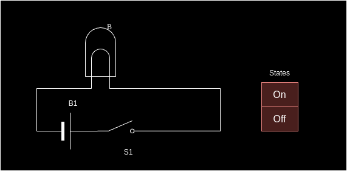

# Introduction

According to the [Python Software Foundation](https://www.python.org/doc/essays/blurb/?external_link=true), the organization behind Python, 
> Python is an interpreted, "object oriented", high level programming language with dynamic semantics.

Please note that as Python and its associated libraries is an extremely large subject that can be used to solve any computer science problem and takes many years to master. We shall remain focussed on concepts that are relevant in the context of data, machine learning and AI.

Now, let us unpack these terms one by one to understand what it means. However, before we do that, we need to dwell into the basics of how computers work!

# What is a computer and how does it work

We use computers everywhere - not just our laptop/desktop computers but we use them for everything from simple calculators to controlling timing on the microwave ovens, our refrigerators, our cars, sometimes even our homes, the mobile phones! Virtually everything around us use computers in some form and the fundamental question to ask is why is that so? 

The answer lies in some of these features of computers:

1. Computers can calculate very fast and with numbers of size that the human mind simply cannot deal with
2. Computers can do certin tasks repetitively  
3. Computers can also control certain devices based on these calculations 
4. Computers can generate data based on existing data using mathematical models

So what are the foundations of computer then? The answer lies in understanding a little bit of electronics. We will not dwell into a detailed exposition on electronics but just undertand it at a conceptual level to help us understand how computers work. Consider a simple electronic circuit consisting of a Battery B1, a Switch S1 and a BulbB. 

As you can see, you can have *two* states in this circuit i.e. the Bulb lights up or is "On" when the switch is pressed and it does not light up or is "Off" when the switch is pressed again!

Now let us consider two such set ups so that one case control the two bulbs independently. Therefore, we have Switch S1 controlling a Bulb which is powered by battery B1 and a Switch S2 controlling a Bulb powered by Battery B2. You will notice that now this allows us to *four* states as shown in the table!

Extending this further, if we have three independent switches, we can control three bulbs giving rise to *eight* states as seen in the table!

As you can notice, each circuit can have two states but combining those circuits gives rise to  2n states where n is the number of circuits! 
Why is this important to know? This is important because this is the foundation of how computers represent and store data. In a real computer, the **circuits** are replaced by electronic components called as transistors which can be switched on and off. Millions of such transitors go into what we call micro processor chips such as the Intel/AMD processor or ARM processor as well as in memory modules.

Let's take a simple example of a *eight bit* processor. This means that the processor can deal with information coming out of at the most *eight* equivalent circuits of the type that we have seen from the bulb like examples above. How is this information represented? 

Consider this table:

| 0 | 1 | 0 | 1 | 1 | 0 | 1 | 1 |
|---|---|---|---|---|---|---|---|

This table is a representation of the "states" of those switches - 0 repersenting a OFF and 1 representing an ON. How do we interpret these states? 
- One way of interpreting this state is to simply look at these states being a binary number and convert binary to decimal using powers of two i.e. 01011011 can be written starting from units place as
  - 1x20 + 1x21 + 0x22 + 1x23 + 1x24 + 0x25 + 1x26 + 0x27
  - = 1+2+0+8+16+0+64+0 = 91!
 
Now 91 is a number using *one* interpretation. It can also be interpreted as a character **[** if we apply the [ASCII](https://en.wikipedia.org/wiki/ASCII) "encoding" standards. Thus the electronics in computers can control and manipulate bits or switches which is represented as "information" by applying appropriate encoding standards. 
> Instructing the computer how to manipulate electronic circuits in the form of processors and memory and interpret the resulting information is precisely what is done by computer programmers!

 # The concept of Abstraction, Compiled Lanaguages and Interpreted Languages
 A human when given a a simple instruction such as "Write your name" will break it into the following activities:

- Find a pen/pencil
- Find the paper to write the name on
- Hold the pen in the appropriate hand
- Write his/her name   

As one can see, the simple instruction is broken down into many smaller steps. The process of hiding the detailed step is called as abstraction. The simple intruction is set to be working on a **higher** level of abstraction while the detailed steps are set to be at a **lower** level of abstraction.  Similarly, typical computer programmers do not operate at the level in which they think in terms of bits i.e. at one of the *lowest* level of abstraction. Instead, tasks such as bit manipulation are made available in simple English language like "instructions" and are called as **Instruction Sets** for the CPU. This is also called as machine code. Most modern day programs do not operate at this level either, and rely on programming languages at a much *higher* level of abstraction, which are then translated into low level machine code or instrcution sets by a software called as a **compiler**.

Working at a higher level allows us to create complex things but the higher levels of abstractions have to be ultimately translated into lowest level of instructions. Depending on the programming language, there are different methods used to deal with these different levels of abstraction:

- For languages like C, C++, Fortran, the compiler takes the entire program as input and emits an executable file which is full of machine code. Such programming languages are called compiled languages. They typicallu result in extremely fast running program which is optimized for a specific CPU architecture and operating system albeit at the cost of portability to other operating systems and CPU architectures.
- In languages such as BASIC, LISP etc, programs are interpreted "line by line" and executed immediately. This means that as long as an interpreter is available for a OS/platform, the same program will work and it is fantastic for portability. However, programs run using interpreted languages tend to run slowly albeit they are slightly easier to debug.
- Modern languages such as Python and Java used another approach - they are compiled to an intermediate format thus making portability easier, and then they are "compiled" to machine code using just in time compilers albeit line by line so behave like interpreted language. They require a software environment to operate in, ususaly called as  the "virtual machine" which does the just in time compilation as well as line by line execution. These languages give us speeds of execution close to that of purely compiled languages but all the advantages of interpreted languages such as ease of development, ability to debug using tools.

Some good references to read about this topic: [Indiana University Knowledge Base](https://kb.iu.edu/d/agsz),[Baeldung](https://www.baeldung.com/cs/compiled-vs-interpreted-languages)

# Understanding the core concepts in Python

These notes will only cover the core concepts useful to get us started with AI/ML using Python and assumes a basic familiarity with the languages. However, the reader is encourage to go through the basics of Python using a good text book or from the [original sources](https://wiki.python.org/moin/BeginnersGuide) There are also excellent free courses available on platforms such as [SWAYAM/NPTEL](https://swayam.gov.in/), [Google}(https://developers.google.com/edu/python),[Learn Python](https://www.learnpython.org/) et al. 

## Lists
Let us start with a basic datastructure: list. A list is simply a way to keep different information together, have means of accessing it using an index, find specific values, apply sorting and so forth. To create a list, one simply puts the collection of values in a square brackets([]), each value being separated by a comma (,)

` my_list_of_even_numbers = [2,4,6,8,10]`

Python lists need not have just one data type. They can also take mixed values:

`my_mixed_list = [10,'John Doe',20,30,'ABC','@@@@'] `

The most obvious operation on any list would be an ability to access elements using simple index. Take a look at the list of even numbers and how it is indexed:

| 0 | 1 | 2 | 3 | 4  |
|---|---|---|---|----|
| 2 | 4 | 6 | 8 | 10 |

The top row starts is the index, the bottom row is the actual value. Note that the first value **starts with an index with a value of 0**. So to print the *third* element in the list (the number 6) we simply write `print(my_list_of_even_numbers[2])` 

The length of the list given by the function **len** and one can see that index of the last element in the list is *len(list) -1* given that the first element has an index of 0

Sometimes, it is convenient to start from the last elelemnt in the list and Python has a nifty syntax for that: Usage of negative index numbers starting with -1 referring to the last element of the list and then going further of the negative number line until the first element of the list is reached. Therefore,
`print(my_mixed_list[-1])` will print **@@@@** while `print(my_mixed_list[-6])` will print **10**

Lists can be **merged** simply by adding them:
` my_list_of_even_numbers = [2,4,6,8,10]
  my_list_of_odd_numbers = [1,3,5,7,9]
  merged_list = my_list_of_even_numbers + my_list_of_odd_numbers`

Printing the merged list will ofcourse lead to 
`print(merged_list)`
> 2,4,6,8,10,3,5,7,9

Note that the lists are merged by appending the second list at the end of the first one. If you want an order in the list, you will need to sort it.

Another important operation with lists is an ability to create sub lists from an existing list. This sub list is called a **slice**. As an example, consider this list of names:
`list_of_names = ['Amit','Bhavesh','Chaitanya','Dilshad','Emraan','Faizan','Gargi','Hrishi']`
Now if I want a sublist with every second name in the list, I can do that by creating a sublist a.k.a. slice from this list:
`sub_list_1 = list_of_names[1:8:2]`
Note the syntax for creating a slice within the square brackets:

| Start Index | End Index +1 | Step |
|-------------|--------------|------|

Start index refers to where to start slicing; end index has a 1 added to it because indices start at 0, hence the second parameter needs a one added to it; the third parameter is a step function which tells python to skip certain number of elements after starting from start index. 
> Slicing does not change the original list; it creates a new list that is made by copying only those elements from the original list which need to be part of the sub list as defined by the slicing parameters.

Strings in Python also support slicing function and work in a similar manner. However, ** strings in python are immutable i.e. they cannot be changed and any change to a string results in the creation of a new string! ** In lists, values *can* be changed in place. Slicing, of course, results in new lists.

